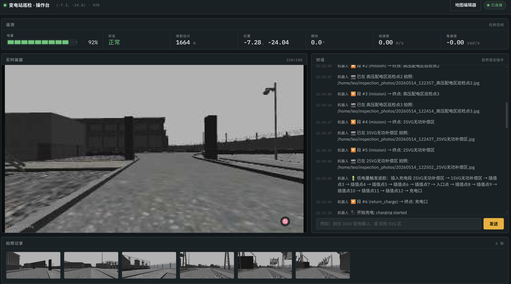
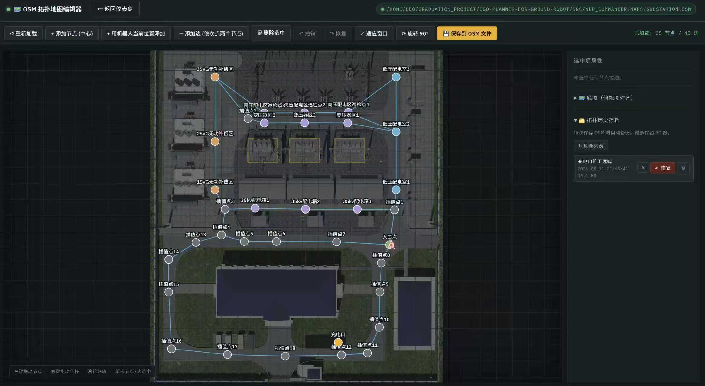
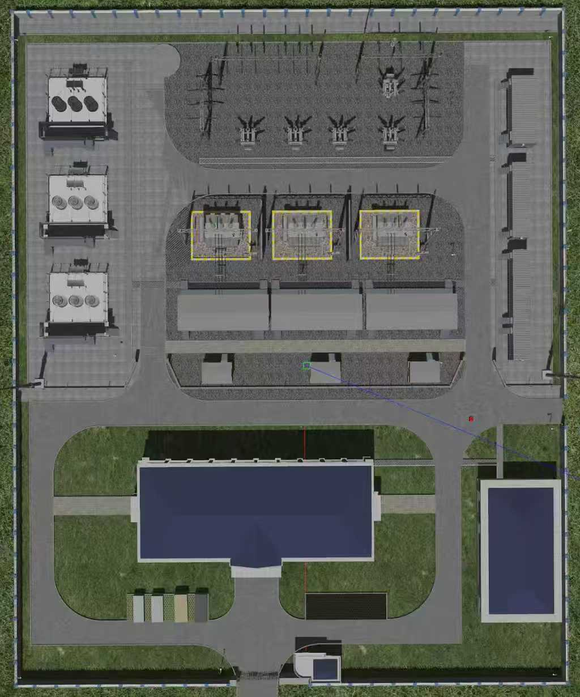
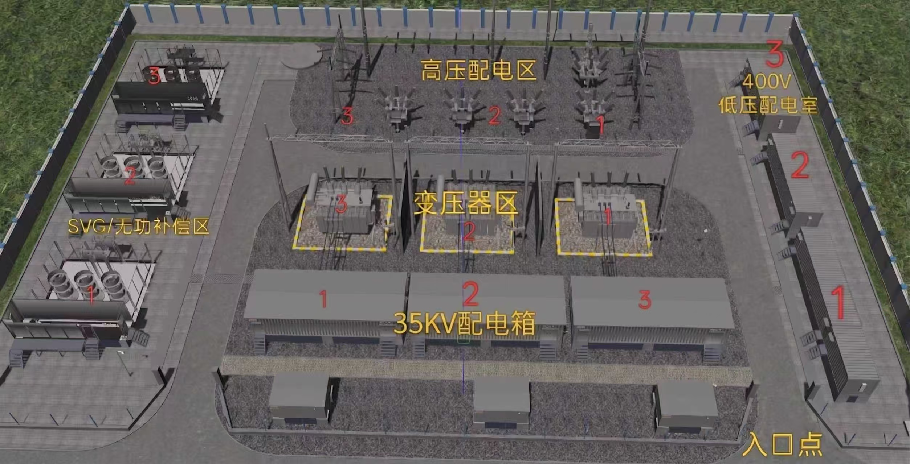
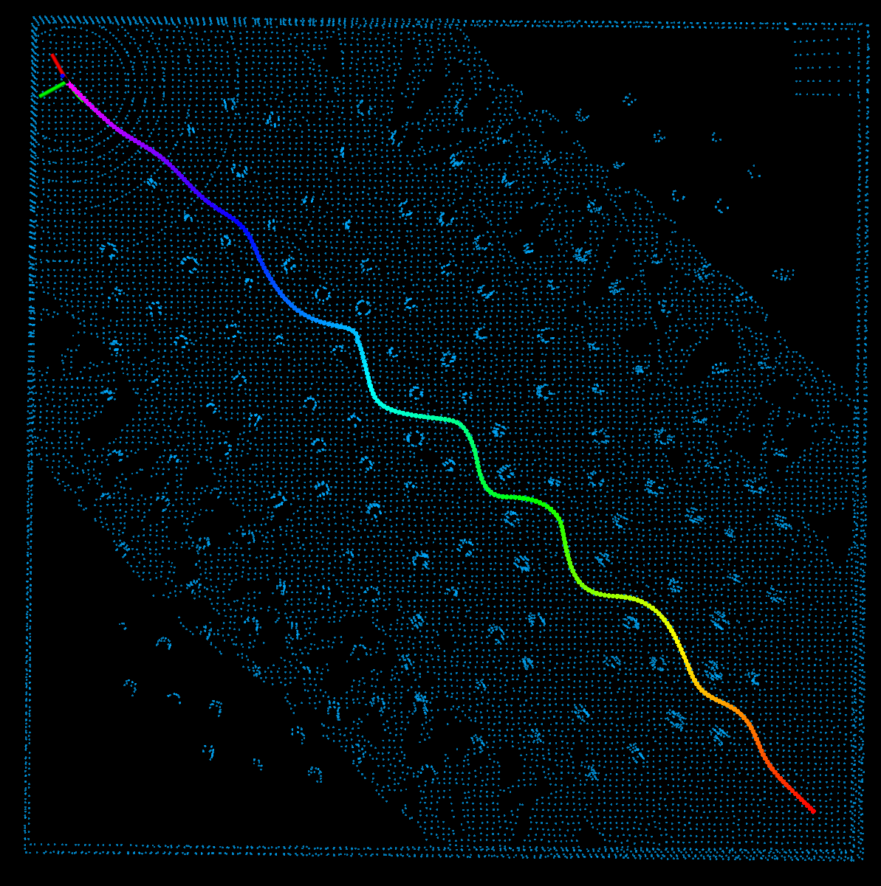
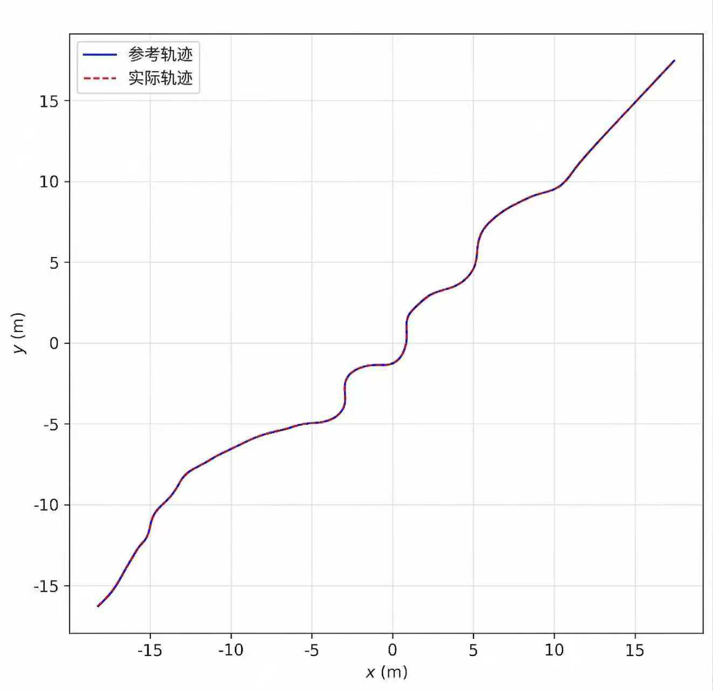

# OmniInspect

Language-guided substation inspection simulation, planning, and control stack for a differential-drive ground robot.

[中文说明](README.zh-CN.md) | English




## What Is OmniInspect?

OmniInspect is a ROS Noetic workspace for language-guided substation inspection with a differential-drive ground robot.
It integrates natural-language task understanding, topology-semantic maps, global waypoint generation, local trajectory optimization, MPC tracking, Gazebo simulation, inspection services, battery-aware return-to-charge behavior, and a web operator dashboard.

Instead of being an isolated planning demo, OmniInspect is designed as a runnable end-to-end inspection loop.
A user enters a command such as "go to 35kV cabinet 2", "inspect the SVG compensation area", or "perform a full inspection"; the system maps the command to semantic equipment or regions, generates waypoints and smooth trajectories, and completes navigation, photo capture, return-to-charge recovery, and task continuation in simulation.

## Highlights

- **LLM for task parsing, deterministic modules for safety-critical decisions**: the language model produces structured task intent, while target validation, topology search, battery return policy, and path execution remain local and deterministic.
- **OSM-based topology-semantic map**: the same XML map describes equipment, regions, inspection points, and graph edges for LLM context, Dijkstra search, and web editing.
- **Differential-drive planning and control stack**: the planner uses differential flatness to connect geometric trajectories with linear/angular velocity constraints.
- **B-spline and MINCO backends**: B-splines provide local support and efficient refinement; MINCO jointly optimizes intermediate waypoints and segment times.
- **Ground-robot-specific MINCO improvements**: denominator-free curvature constraints, Huber-style penalties, multi-topology candidate selection, and braking-window recovery improve numerical stability and online safety.
- **MPC tracking loop**: a linearized QP-based MPC controller uses flatness-derived feedforward inputs and RK4 delay compensation.
- **Observable web demo**: the dashboard shows robot state, camera view, language dialogue, battery state, and photo events; a map editor is available at `/map`.
- **Open-source-friendly asset handling**: the large high-fidelity substation model is distributed through GitHub Releases, not normal Git history.

## User Interface

Start the integrated demo and open:

```text
http://localhost:5000/
```

The dashboard contains:

- Robot position, heading, linear/angular velocity, battery percentage, charging state, and estimated remaining range.
- Live Gazebo camera stream from `/camera/image`.
- Natural-language command input and system responses.
- Photo event gallery; images are saved to `~/inspection_photos/` by default.


The semantic map editor is available at:

```text
http://localhost:5000/map
```

It edits inspection-point coordinates, graph edges, and semantic tags in the OSM map.



The repository supports a lightweight Gazebo world for quick testing and a high-fidelity DAE-based substation model for demonstrations.





## Quick Start

Recommended platform:

- Ubuntu 20.04
- ROS Noetic
- Gazebo 11
- Python 3.8
- `catkin_tools`

Install tools:

```bash
sudo apt update
sudo apt install python3-catkin-tools python3-rosdep
```

Initialize rosdep if needed:

```bash
sudo rosdep init
rosdep update
```

Build:

```bash
git clone https://github.com/meilaoliu/OmniInspect.git
cd OmniInspect
rosdep install --from-paths src --ignore-src -r -y
catkin config --cmake-args -DCMAKE_BUILD_TYPE=Release
catkin build
source devel/setup.bash
```

Natural-language features use Alibaba Cloud DashScope's OpenAI-compatible endpoint by default.
The default model configuration is Qwen:

```bash
export DASHSCOPE_API_KEY=...
# Optional defaults used by the code:
export DASHSCOPE_MODEL=qwen3.6-plus
export DASHSCOPE_ENABLE_THINKING=false
export DASHSCOPE_TEMPERATURE=0.1
export DASHSCOPE_MAX_TOKENS=2048
```

The default `base_url` is `https://dashscope.aliyuncs.com/compatible-mode/v1`.
The project uses the `openai` Python package only as an OpenAI-compatible client for DashScope.
`OPENAI_API_KEY` is accepted only as a compatibility fallback; for normal OmniInspect usage, set `DASHSCOPE_API_KEY`.
To use another OpenAI-compatible provider, override both `DASHSCOPE_BASE_URL` and `DASHSCOPE_MODEL`.

Do not commit API keys.

## Run the Integrated Demo

Lightweight scene:

```bash
source devel/setup.bash
roslaunch inspection_dashboard inspection_full.launch realistic:=false initial_battery:=100.0
```

Open:

```text
http://localhost:5000/
```

Try a command in the web input box:

```text
前往35kv配电箱2
```

Expected behavior:

1. `nlp_commander` maps the equipment name to the OSM semantic map.
2. The segment scheduler publishes a waypoint segment.
3. The planner generates a continuous trajectory and the robot moves in Gazebo/RViz.
4. Arrival triggers `/segment_done`.
5. The system calls `/take_photo`; the photo appears in the dashboard gallery.
6. After a short dwell time, the task is marked complete.

Additional examples:

```text
检查SVG无功补偿区
巡检变压器区域
检查所有低压配电室
完整巡检一遍
沿着刚刚的路线巡检五分钟，然后返回充电
```

High-fidelity scene:

```bash
scripts/download_substation_assets.sh
source devel/setup.bash
roslaunch inspection_dashboard inspection_full.launch realistic:=true initial_battery:=35.0
```

The realistic launch file sets `GAZEBO_MODEL_PATH` automatically.
Normal users do not need to edit `~/.bashrc`.

## Module Documentation

| Module | Purpose | Docs |
| --- | --- | --- |
| `inspection_dashboard` | Web UI, SocketIO/ROS bridge, map editor | [README](src/inspection_dashboard/README.md), [DEMO](src/inspection_dashboard/DEMO.md) |
| `nlp_commander` | LLM task parsing, OSM map loading, scheduling, battery-aware recovery | [README_V2](src/nlp_commander/docs/README_V2.md), [PATH_OPTIMIZATION_SUMMARY](src/nlp_commander/docs/PATH_OPTIMIZATION_SUMMARY.md) |
| `inspection_services` | `/take_photo` service and `/photo_event` events | [launch](src/inspection_services/launch/photo_service.launch) |
| `battery_simulator` | battery drain, low-battery warning, charging service | [launch](src/battery_simulator/launch/battery_monitor.launch) |
| `substation_description` | high-fidelity DAE model metadata and asset placeholders | [README](src/substation_description/README.md) |
| `vehicle_simulator` | Gazebo worlds, URDF, sensors, vehicle simulation | [launch](src/autonomous_exploration_development_environment/src/vehicle_simulator/launch) |
| `ego-planner/planner` | search, map, B-spline, MINCO, MPC, FSM | [source](src/ego-planner/planner) |
| `navigation_baseline` | DWA/TEB baseline launch files | [launch](src/navigation_baseline/launch) |
| `benchmark` | experiment scripts and regression tests | [source](src/benchmark) |

## Planning and Control

The language pipeline converts commands into structured inspection tasks, but local deterministic modules handle topology, geometry, and safety.
This avoids relying on the LLM for target existence, graph connectivity, battery return feasibility, or collision-related decisions.

The B-spline backend uses differential flatness, cubic uniform B-splines, ESDF-free collision gradients, smoothness penalties, dynamic feasibility penalties, time reallocation, and trajectory refinement.
In the thesis simulation benchmark, it achieved **1.66 ms** average planning time and **96%** success over 50 fixed target tasks.

The MINCO backend jointly optimizes intermediate waypoints and segment times.
For a differential-drive robot, OmniInspect adds denominator-free curvature constraints, Huber-style penalty shaping, gradient backpropagation to path and virtual-time variables, multi-topology candidate selection, and braking-window recovery after failed replanning.

In the same benchmark:

| Method | Planning time (ms) | Trajectory time (s) | Length (m) | Curvature smoothness | Success |
| --- | ---: | ---: | ---: | ---: | ---: |
| DWA | 3.12 | 11.28 | 9.87 | 2.15 | 82% |
| TEB | 12.87 | 8.64 | 9.12 | 1.32 | 90% |
| B-spline | 1.66 | 7.32 | 8.85 | 0.76 | 96% |
| MINCO | 0.64 | 4.85 | 5.26 | 0.52 | 100% |



The MPC controller tracks B-spline or MINCO trajectories by linearizing the differential-drive model along the reference trajectory and solving a QP every control cycle.
It uses flatness-derived feedforward `v_ref` and `omega_ref`, terminal state weighting, input constraints, and RK4 delay compensation.

In the thesis simulation benchmark, MPC solved the QP in **0.45 ms** on average under a 30 ms control period.
The overall lateral tracking error was **2.5 cm** on average, and the mean heading error was **1.4°**.
Feedforward inputs reduced curve lateral error from **8.7 cm** to **3.5 cm**; RK4 delay compensation reduced average lateral error from **5.8 cm** to **2.4 cm** under a 50 ms delay setting.



## Assets

The high-fidelity `substation_dae` mesh and textures are too large for normal Git history.
They are distributed as a GitHub Release asset:

```bash
scripts/download_substation_assets.sh
```

Default URL:

```text
https://github.com/meilaoliu/OmniInspect/releases/download/assets-v1/substation_dae_assets_v1.tar.gz
```

Maintainers can create the release archive with:

```bash
scripts/package_substation_assets.sh
```

See [docs/assets.md](docs/assets.md) and [docs/release.md](docs/release.md).

## Baselines, Tests, and Release Checks

```bash
scripts/run_dwa_simulation.sh
scripts/run_teb_simulation.sh
scripts/run_dense_simulation.sh
scripts/run_mpc_experiments.sh
```

```bash
source devel/setup.bash
python3 -m pytest src/benchmark src/nlp_commander/tests
scripts/check_release_tree.sh
```

## License

OmniInspect project code is released under the BSD 3-Clause License.
Third-party components retain their original licenses; see [THIRD_PARTY_NOTICES.md](THIRD_PARTY_NOTICES.md).
