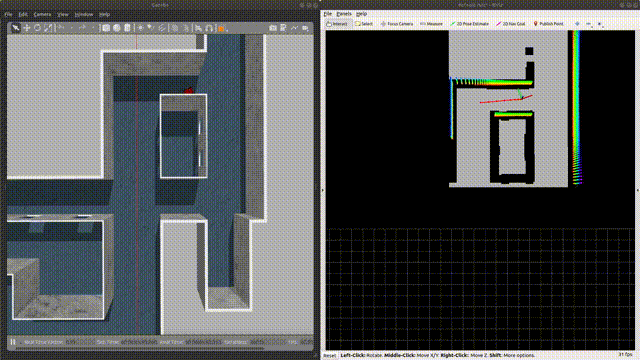

[toc]

# Environment Configuration

## qpOASES

We use qpOASES to solve MPC，and MPC is used for trajectory tracking

qpOASES  solver installation :

```bash
cd qpOASES
mkdir build
cd build
cmake ..
sudo make
sudo make install
```

## patchwork

patchwork is used for ground segmentation. This planner accepts 3d point cloud information **Pointcloud2**. After the point cloud is segmented on the ground, the point cloud is projected to the 2d plane to construct a 2d grid map for planning.

Follow the official repository to download this package：[patchworl_github](https://github.com/LimHyungTae/patchwork)

## Simulation environment

The simulation environment uses the open source simulation environment of the CMU Robotics Institute. Users  need to install the relevant libraries and download the mesh file. We recommend to use the indoor environment to test the planner.

The environment have two versions for ros-melodic and ros-noetic. The package in this project is for ros-melodic.

[CMU-environment](https://www.cmu-exploration.com/)

# Quick Start

First , start the simulation environment :

```bash
roslaunch vehicle_simulator system_indoor.launch
```

Second, start the planner :

```bash
roslaunch ego_planner run_in_sim.launch
```

In rviz , use  **2d nav goal** to set the goal :



If you can't see the imag in this file, you can see it in the folder "imag".

## 真实变电站场景启动 (Blender导入)

此场景是基于从Blender导出的高精度DAE模型，提供了更逼真的仿真环境。

**第一步：设置Gazebo模型路径**

为了让Gazebo能够找到自定义的变电站模型，需要将模型所在的工程目录添加到环境变量中。打开一个新终端，执行以下命令（此操作只需执行一次）：
```bash
echo 'export GAZEBO_MODEL_PATH=$GAZEBO_MODEL_PATH:/home/leo/Graduation_Project' >> ~/.bashrc
source ~/.bashrc
```

**第二步：启动仿真环境**

在一个新的终端中运行以下命令来启动逼真的变电站场景：
```bash
source devel/setup.bash
roslaunch vehicle_simulator system_substation_realistic.launch

简易环境：
source devel/setup.bash
roslaunch vehicle_simulator system_substation.launch

```
> **注意**: 由于DAE模型文件较大(约370MB)，Gazebo首次加载此环境可能会非常缓慢，请耐心等待。

**第三步：启动规划器**
```bash
source devel/setup.bash
roslaunch ego_planner run_in_substation.launch

简易环境规划器：
source devel/setup.bash
roslaunch ego_planner run_in_sim.launch

```

**第四步：启动LLM语义指挥节点**
```bash
cd ~/Graduation_Project/ego-planner-for-ground-robot
source devel/setup.bash

# 首次使用前配置大模型 API Key，也可以写入 ~/.bashrc
export DASHSCOPE_API_KEY="你的DashScope API Key"

# 默认推荐 qwen3.6-plus：指令解析效果、速度和成本更均衡
export DASHSCOPE_MODEL="qwen3.6-plus"

# 机器人在线指令解析默认关闭思考模式，降低响应延迟
export DASHSCOPE_ENABLE_THINKING=false

# 可选：按需覆盖调用地址和生成参数
# export DASHSCOPE_BASE_URL="https://dashscope.aliyuncs.com/compatible-mode/v1"
# export DASHSCOPE_TEMPERATURE=0.1
# export DASHSCOPE_MAX_TOKENS=2048

# 若本机代理配置会干扰 DashScope 连接，可临时开启代理清理
# export DASHSCOPE_CLEAR_PROXY=1

# 启动基于 OSM 语义地图 + Dijkstra 的 V2 节点
rosrun nlp_commander substation_nlp_commander_node_v2.py
```

若提示缺少 `openai` Python 包，可在当前 ROS Python 环境中安装：
```bash
pip install openai
```

`nlp_commander_node.py` 是早期单文件版本，内部坐标和任务逻辑已经不再与当前变电站 OSM 地图保持同步；后续实验建议统一使用 `substation_nlp_commander_node_v2.py`。

关于模型选择，阿里云百炼文档推荐通用任务优先使用 `qwen3.6-plus`。
它支持 OpenAI 兼容 Chat Completions、JSON Mode、Function Calling 和 100 万上下文，足够覆盖当前“中文指令 → 结构化巡检任务”的场景。
如果后续要处理更复杂的多轮推理、跨文档规划或很绕的组合指令，可以把 `DASHSCOPE_MODEL` 改为 `qwen3.6-max-preview`。
注意模型 ID 不是 `qwen 3.6 max`，而是 `qwen3.6-max-preview`；该模型推理能力更强，但成本更高、上下文为 256k，当前不建议作为默认值。
Qwen3.6 系列默认支持思考模式，在线机器人控制更看重响应速度，所以代码默认通过 `DASHSCOPE_ENABLE_THINKING=false` 关闭；需要提升复杂指令理解时再改为 `true`。
若要单独测试百炼接口，可在确认 API Key 有效后运行 `RUN_REAL_LLM_TEST=1 python3 src/nlp_commander/tests/test_llm_simple.py`；默认不会主动发起真实请求。
如果测试输出 `Connection error`，先确认 `DASHSCOPE_BASE_URL` 没有被误设，并运行以下不含密钥的连通性检查：
```bash
curl -sS -o /dev/null -w '%{http_code} %{remote_ip} %{ssl_verify_result}\n' \
  https://dashscope.aliyuncs.com/compatible-mode/v1/models
```
正常情况下，该命令应能返回 `401` 和远端 IP，表示网络、DNS 与 TLS 都是通的；随后再检查测试脚本打印出的 `base_url`、`key_length` 和 `proxy_env`。
如果报错中出现 `Unknown scheme for proxy URL URL('socks://127.0.0.1:7890/')`，说明 Python 的 `httpx` 不接受当前 `socks://` 代理写法。
最简单的处理方式是临时忽略代理后重试：
```bash
export DASHSCOPE_CLEAR_PROXY=1
RUN_REAL_LLM_TEST=1 python3 src/nlp_commander/tests/test_llm_simple.py
```
若必须使用代理，则优先把代理变量改成 Clash 常见的 HTTP 代理地址：
```bash
export http_proxy="http://127.0.0.1:7890"
export https_proxy="http://127.0.0.1:7890"
export all_proxy="http://127.0.0.1:7890"
```
只有确认当前 Python 环境安装了 SOCKS 支持时，才使用 `socks5://127.0.0.1:7890`，不要写成 `socks://127.0.0.1:7890/`。

### LLM语义指挥节点说明

`nlp_commander` 的 V2 版本对应论文第二章中的前端任务规划流程：

1. `maps/simplified_substation.osm` 作为简化语义地图注入大模型提示词，大模型输出 `task_type`、`target_devices` 和 `task_description` 等 JSON 字段。
2. `maps/substation.osm` 保存完整节点坐标与 `<way>` 连通关系，代码优先从 OSM 中读取拓扑边；若地图缺少连通关系，才回退到内置邻接表。
3. `PathPlanner` 使用 Dijkstra 计算相邻目标之间的最短路径。多目标无显式顺序时采用最短路代价贪心排序；用户明确给出顺序时保留该顺序。
4. `WaypointManager` 将规划出的全局 Waypoint 序列逐点发布到 `/move_base_simple/goal`，并通过 `/odom_adjust` 判断是否到达当前目标。

常用交互指令示例：

- 单点巡检：`前往35kv配电箱2`
- 区域巡检：`检查SVG无功补偿区`
- 完整巡检：`完整巡检一遍`
- 控制命令：`status`、`graph`、`pause`、`resume`、`stop`


### 3. 设置巡检目标点

在 RViz 中使用 **2D Nav Goal** 工具设置目标点，设备点：

1. 入口点：(9, 27)
2. 低压配电室1：(-8, 29)
3. 低压配电室2：(-26 , 29)
4. 低压配电室3： (-43 , 29)
5. 高压配电区巡检点1：(-31 , 13)
6. 高压配电区巡检点2：(-32 , -1)
7. 高压配电区巡检点3：(-32 , -17)
8. 变压器区1：(-28 , 14)
9. 变压器区2：(-29 , 0.91)
10. 变压器区3：(-28 , -11)
11. 3SVG无功补偿区:（-43 ， -27）
12. 2SVG无功补偿区:（-23 ， -27）
13. 1SVG无功补偿区:（-8 ， -27）
14. 35kv配电箱1：(-2 , -14)
15. 35kv配电箱2: (-2 , 1)
16. 35kv配电箱3：（ -2 ，17）

建议巡检路径：

1. 入口点：(9, 27)
2. 插值点1 （3， 28）
3. 低压配电室1：(-8, 29)
4. 低压配电室2：(-26 , 29)
5. 低压配电室3： (-43 , 29)
6. 高压配电区巡检点1：(-30 , 13)
7. 高压配电区巡检点2：(-30 , -1)
8. 高压配电区巡检点3：(-30 , -17)
9.  3SVG无功补偿区:（-43 ， -27）
10. 2SVG无功补偿区:（-23 ， -27）
11. 1SVG无功补偿区:（-8 ， -27）
12. 35kv配电箱1：(-2 , -14)
13. 35kv配电箱2: (-2 , 1)
14. 35kv配电箱3：（ -2 ，17）
15. 插值点1：（3 ，28）
16. 入口点：(9, 27)


# 参数调整说明

在 CMU 提供的仿真环境中，小车并不具备真实的物理引擎，能够完全按照控制指令 (线速度 v 和角速度 w) 进行运动，这会影响到 MPC 控制器的参数设定

MPC 控制器的目标函数由两部分组成：跟踪误差和运动限幅。用户可以通过下面 4 个参数进行调整：

```xml
<!-- adjust in advanced_param.xml -->
<param name="MPC/v_max" value="1.8" type="double"/>
<param name="MPC/w_max" value="1.2" type="double"/>
<param name="MPC/omega0" value="1.0" type="double"/>
<param name="MPC/omega1" value="0.5" type="double"/>
```

`MPC/v_max` 与 `MPC/w_max` 与规划时设定的最大速度与加速度有关，可以设置成略大于规划最大速度 `max_vel` 的数值

`MPC/omega0` 和 `MPC/omega1` 分别为上述跟踪误差和运动限幅两项的权重：

1. `omega0` 越大，MPC 求解结果越倾向于减小误差，但有可能超过机器人的运动学极限
2. `omega1` 越大，MPC 求解结果越倾向于使得机器人的运动更平滑，但与参考轨迹之间的误差会增大

在 CMU 提供的仿真环境中，本人建议调大 `omega0`，因为该仿真环境中小车的运动不受限制

但在存在物理引擎的仿真环境中，建议适当调大 `omega1`，否则很容易出现角速度和线速度过大的现象，导致机器人运动不平滑

计划在分支中提供一版联合 SLAM 和具有物理引擎的仿真环境的 ego-planner，后面有时间整理后再上传

# 智能巡检系统（毕设联调）

> 本节描述在原 ego-planner-for-ground-robot 之上新增的"自然语言指令 → 分段全局轨迹 → 拍照 → 低电返航"完整巡检流水线。
> 全部新功能与 **B 样条 / MINCO** 两种轨迹后端均兼容（仅依赖高层 `planGlobalTrajWaypoints` 与 `/global_waypoints` 接口）。

## 系统组成

| 包                        | 节点 / 内容                                    | 作用                                                              |
| ------------------------- | ---------------------------------------------- | ----------------------------------------------------------------- |
| `nlp_commander`           | `substation_nlp_commander_v2` + `SegmentScheduler` | LLM 解析指令 → Dijkstra 路径 → 按"停留点"切段 → 调度全局轨迹       |
| `inspection_services`     | `photo_service_node` + `/take_photo`           | 缓存 `/camera/image`，按需保存照片并广播 `/photo_event`           |
| `battery_simulator`       | `battery_monitor_node`                         | 虚拟电量：基础时间衰减 + 运动消耗 + 拍照消耗，发布 `/battery_state` 与 `/low_battery_alert` |
| `inspection_dashboard`    | `dashboard_node.py` (Flask + SocketIO)         | 浏览器仪表盘：状态 / 实时画面 / 对话框 / 拍照画廊                 |
| `ego_planner` (修改)      | FSM 新增 `flight_type=3` (DYNAMIC_WAYPOINTS)   | 订阅 `/global_waypoints`，分段执行；段完成时广播 `/segment_done`   |

数据流：

```
NL 指令 ─┐
浏览器 ─┴→ nlp_commander.SegmentScheduler ──/global_waypoints──▶ ego_planner FSM
                  ▲                              │
                  │                              └──/segment_done──┐
                  ├──/low_battery_alert────── battery_monitor      │
                  ├──/take_photo (srv) ────── photo_service ────/photo_event──┐
                  └──/charge   (srv) ──────── battery_monitor                 │
                                                                              ▼
                                                                inspection_dashboard
```

## 一键启动

```bash
catkin_make             # 首次或修改 C++/包结构后
source devel/setup.bash
roslaunch inspection_dashboard inspection_full.launch \
    realistic:=false           \   # true = 高保真场景 (慢)
    use_global_traj:=true      \
    initial_battery:=100.0     \
    low_battery_threshold:=20.0 \
    dashboard_port:=5000
# 浏览器打开 http://localhost:5000/
```

切换规划器后端：在 `ego-planner/planner/plan_manage/launch/advanced_substation_param.xml` 中
修改 `manager/use_minco`：`true` = MINCO，`false` = B 样条。两种后端下的接口完全一致。

## 关键参数

| 参数 (rosparam, `~`)            | 默认  | 说明                                        |
| -------------------------------- | ----- | ------------------------------------------- |
| `nlp_commander/use_global_traj`  | true  | true=分段全局轨迹模式；false=逐航点旧模式   |
| `nlp_commander/dwell_seconds`    | 3.0   | 到达停留点拍照后的停留秒数                  |
| `nlp_commander/arrive_tolerance` | 0.5 m | 段终点到位检测半径（与 FSM 3D 距离判定一致）|
| `nlp_commander/waypoint_z`       | 0.75  | 与机器人 odom z 一致，避免 3D 距离不收敛    |
| `nlp_commander/charge_full_threshold` | 95% | 充电恢复任务的电量阈值                  |
| `battery_monitor/low_threshold`  | 20%   | 触发 `/low_battery_alert` 的阈值            |
| `battery_monitor/initial_percentage` | 100 | 初始电量；演示低电返航时设为 35           |
| `inspection_dashboard/port`      | 5000  | Web 仪表盘端口                              |
| `inspection_dashboard/camera_max_hz` | 5 | 浏览器画面推送频率上限                      |

## 演示脚本

1. **单点拍照**
   `roslaunch inspection_dashboard inspection_full.launch`
   浏览器输入：`前往35kv配电箱2`

2. **多点巡检（3 个停留点）**
   `检查SVG无功补偿区`

3. **低电量自动返航 + 续接任务**
   `roslaunch inspection_dashboard inspection_full.launch initial_battery:=35.0`
   浏览器输入：`完整巡检一遍`
   预期：执行至电量 < 20% → 完成当前段后插入"返回入口点"段 → 充满 → 续接剩余段

## 段切分规则

`SegmentScheduler` 按 `SubstationGraph` 输出的 `(name, x, y, stop_required)` 列表切段：
* `stop_required=True` 的航点是段终点；`False` 的航点是段内 min-snap 中间约束（不停车）
* 起始位置（机器人当前位姿）作为第一段的起点；首个停留点（通常是当前所在节点）会被跳过一次
* 每段终点速度 / 加速度 = 0（与论文一致）

## 设计取舍

* 分段调度走的是 ego_planner 现成的 `planGlobalTrajWaypoints()`（min-snap），与局部规划无关，因此 B 样条 / MINCO 切换不影响段调度。
* 低电量返航段是"当前位姿 → 充电点"直线 min-snap；适用空旷变电站。需穿越复杂障碍时可改为先走图路径再调用调度器。
* 拍照通过 ROS service 同步执行，避免与导航并发竞争。
* 仪表盘后端不开 eventlet，使用 `async_mode='threading'` 避免 monkey-patch 与 rospy 冲突。


- 2023.10.31

  修正了小车切换车头的 bug

  修正了 MPC 参数调整的 bug，添加了参数接口与说明

  添加了 CMU 仿真环境的 indoor 场景，用户可以直接测试，无需下载


# THANKS

We are very grateful for Fei Gao and the EGO-Planner he proposed. Our algorithm is implemented under their algorithm framework. If you are interested in our algorithm, you may see the origin algorithm in :

[EGO-Planner](https://github.com/ZJU-FAST-Lab/ego-planner)

